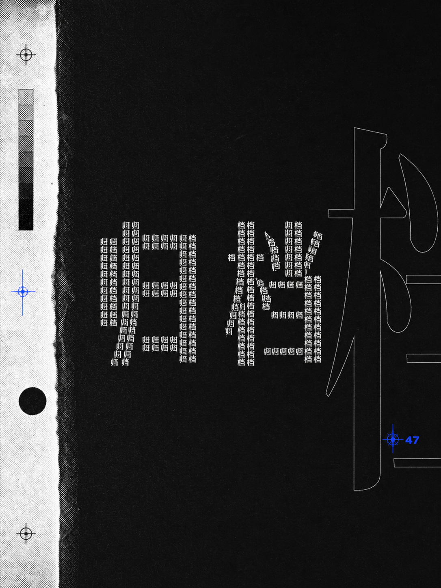
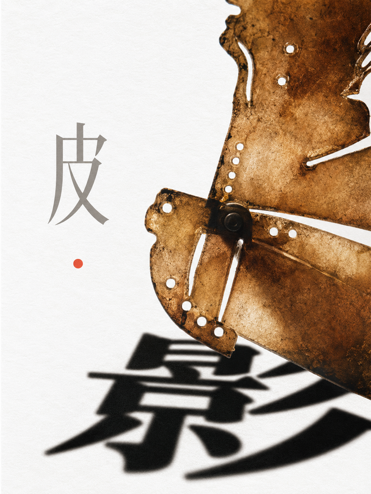
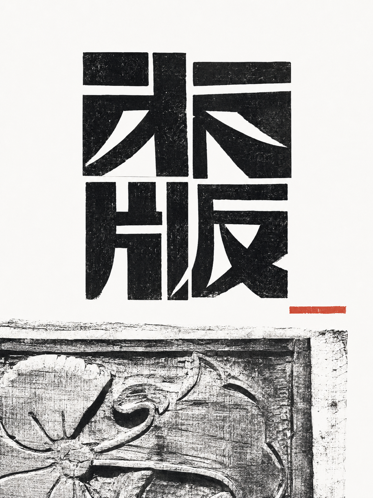
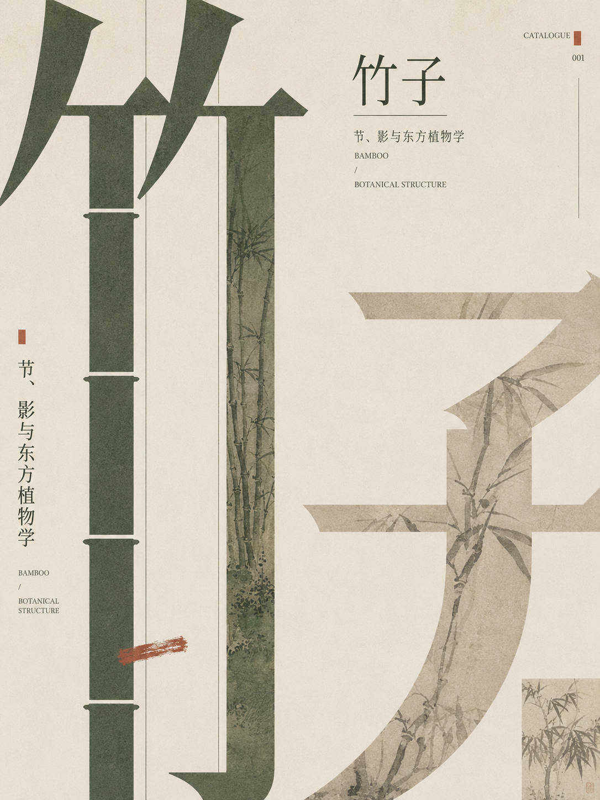
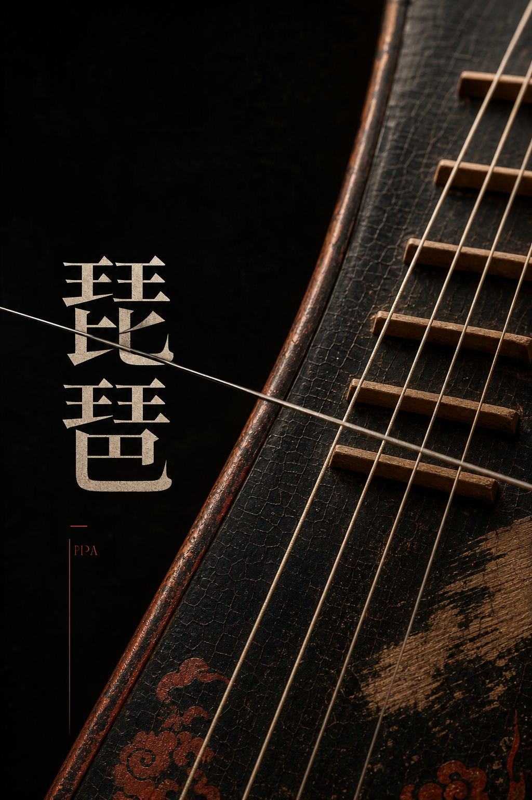
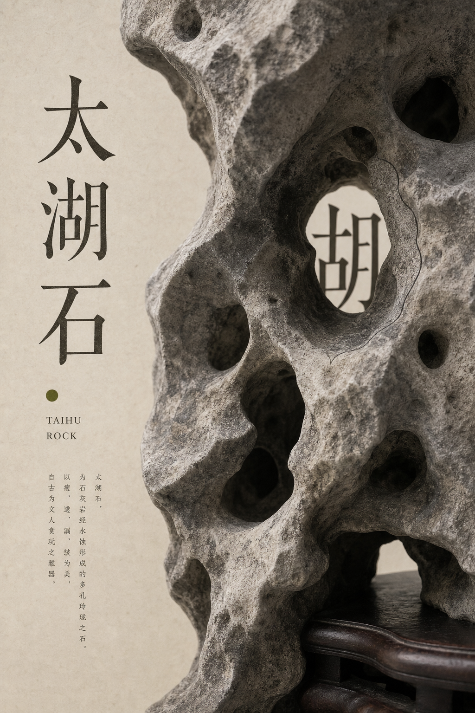
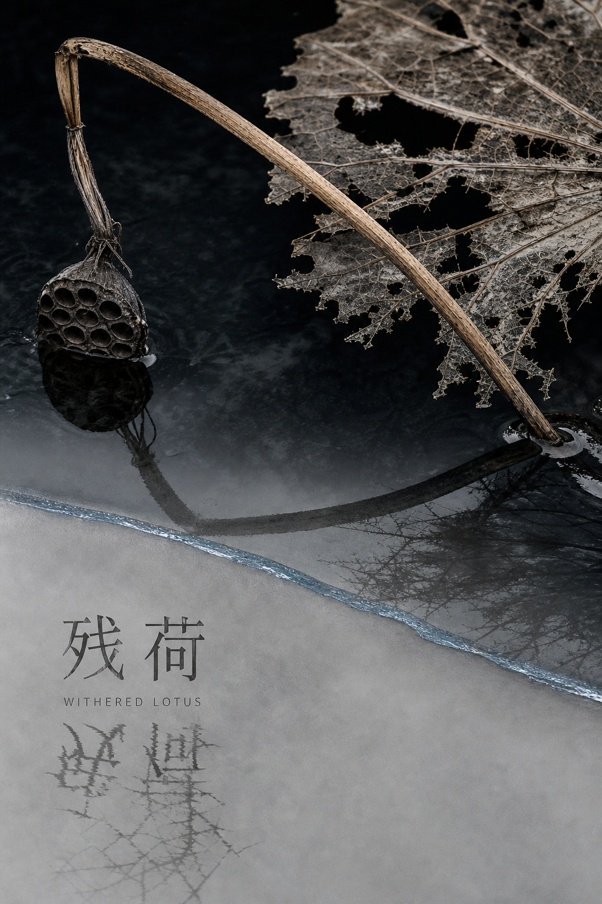
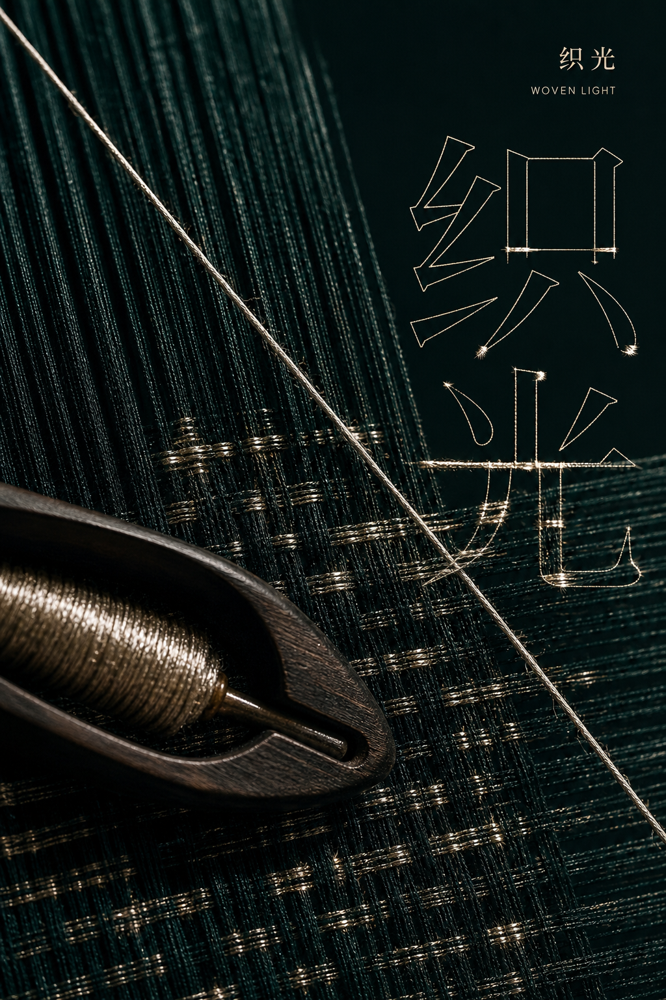
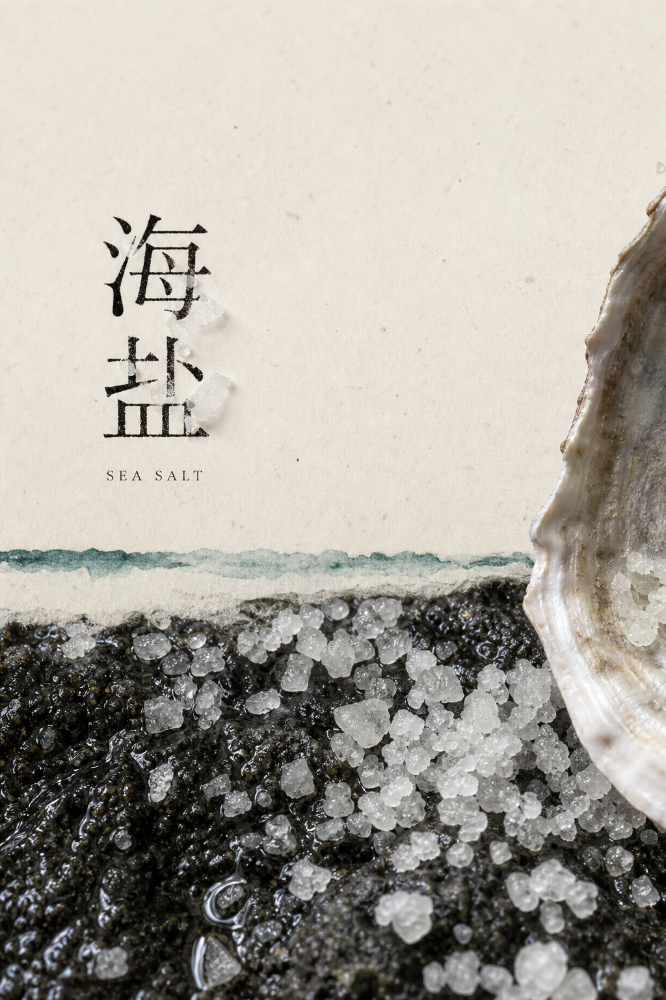
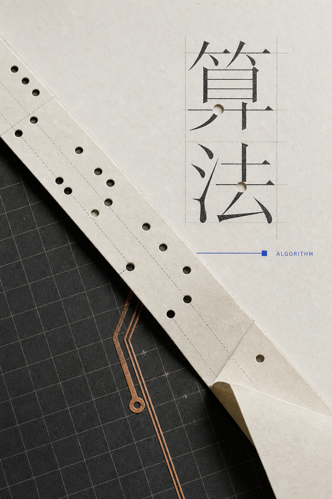

# Examples

这些图用于展示 `oriental-editorial-poster` 追求的“文字创意极简 / 材料证据 / 编辑式封面”方向。

它们是风格样张，不是固定模板；使用 skill 时应学习它们的图文关系、留白节奏和材料逻辑，而不是复制构图坐标。

|  |  |
| --- | --- |
|  |  |
|  |  |
|  |  |
|  |  |
|  |  |

