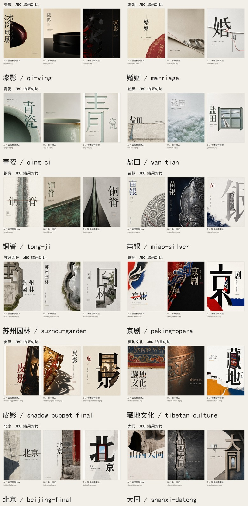
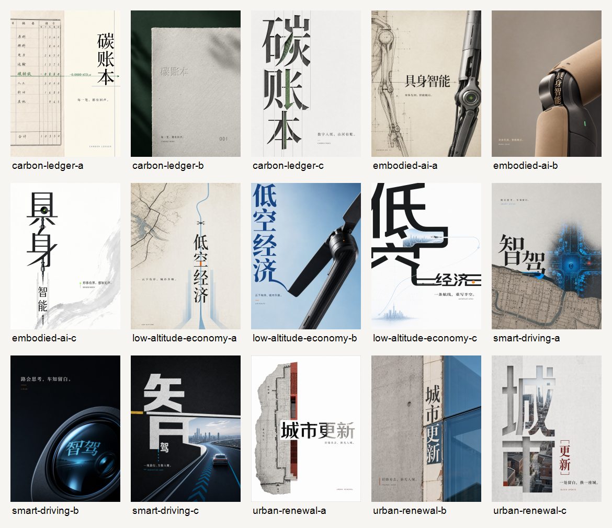

# Fantasy Oriental Editorial Poster v2 Image 2 测试集

这是 `oriental-editorial-poster` / `fantasy-oriental-editorial-poster` v2 的一组 Image 2 出图测试素材，重点验证东方文化题材如何被转译成当代极简编辑海报：短标题、单一物证、字物关系、留白秩序和可追溯 prompt。

## 精选 ABC 三联

已从多轮测试路径中挑出视觉完成度更高、三张成组关系更清楚的 12 组，并重新排成 A/B/C 三联对比图。



每组三联图的标注方式：

- `A / 古图档案介入`
- `B / 单一物证`
- `C / 字体结构实验`

### 精选列表

| 题材 | 三联图 |
| --- | --- |
| 漆影 | [qi-ying-abc-triptych.jpg](selected-triptychs/qi-ying-abc-triptych.jpg) |
| 婚姻 | [marriage-abc-triptych.jpg](selected-triptychs/marriage-abc-triptych.jpg) |
| 青瓷 | [qing-ci-abc-triptych.jpg](selected-triptychs/qing-ci-abc-triptych.jpg) |
| 盐田 | [yan-tian-abc-triptych.jpg](selected-triptychs/yan-tian-abc-triptych.jpg) |
| 铜脊 | [tong-ji-abc-triptych.jpg](selected-triptychs/tong-ji-abc-triptych.jpg) |
| 苗银 | [miao-silver-abc-triptych.jpg](selected-triptychs/miao-silver-abc-triptych.jpg) |
| 苏州园林 | [suzhou-garden-abc-triptych.jpg](selected-triptychs/suzhou-garden-abc-triptych.jpg) |
| 京剧 | [peking-opera-abc-triptych.jpg](selected-triptychs/peking-opera-abc-triptych.jpg) |
| 皮影 | [shadow-puppet-final-abc-triptych.jpg](selected-triptychs/shadow-puppet-final-abc-triptych.jpg) |
| 藏地文化 | [tibetan-culture-abc-triptych.jpg](selected-triptychs/tibetan-culture-abc-triptych.jpg) |
| 北京 | [beijing-final-abc-triptych.jpg](selected-triptychs/beijing-final-abc-triptych.jpg) |
| 大同 | [shanxi-datong-abc-triptych.jpg](selected-triptychs/shanxi-datong-abc-triptych.jpg) |

## 全量预览



## 素材规模

- `images/`: 原始 PNG 出图，包含从更早测试路径补入的高质量完整 ABC 组
- `prompts/`: Markdown prompt 文件
- `selected-triptychs/`: 精选后的 A/B/C 三联对比图
- 主体测试图以 `A / B / C` 三个方向命名，例如 `jingdezhen-bluewhite-a.png`

说明：`contact-sheet.png` 和 `selected-triptychs/*.jpg` 是二次排版预览图，不对应单独 prompt。

## 核心特点

1. **标题先精炼**
   长题材不直接塞进主标题，而是压缩成适合海报阅读的强标题。比如“徽州天井”更适合压成“天井”，再用建筑构件、灰墙、木梁、光井关系表达徽州；“景德镇青花”则应把主标题聚焦到“青花瓷”。

2. **文化靠物证，不靠堆词**
   画面优先使用真实、可识别的文化材料：青花瓷、天井、园林窗洞、鼓楼、皮影、京剧水袖、藏地经幡、胡同砖墙、石窟、运河水系等。文化感来自材料和结构，不来自随机符号拼贴。

3. **ABC 三种测试方向**
   - `A`: 古图、档案、碑帖、版画式介入
   - `B`: 单一器物或材料证据，构图更克制
   - `C`: 字体成为画面结构，强调标题和空间关系

4. **编辑海报优先**
   目标不是旅游宣传图、国潮电商图或博物馆展板，而是竖版 3:4 的当代中文文化海报。画面应有一件“主物证”、一次明确的字物关系，以及大面积安静区域。

5. **避免伪文化感**
   测试后收敛出的反面规则包括：不要编造不存在的文化组合，不要塞满假小字、假印章、二维码、展览日期、随机祥云和景点拼盘。

## 代表题材

| 方向 | 题材示例 | 观察重点 |
| --- | --- | --- |
| 工艺器物 | `jingdezhen-bluewhite-*`, `song-porcelain-*`, `miao-silver-*` | 主标题与器物轮廓、纹样、材质的关系 |
| 建筑空间 | `huizhou-courtyard-*`, `suzhou-garden-*`, `beijing-final-*` | 用空间证据表达地域，而不是把地名写满 |
| 戏曲民艺 | `shadow-puppet-final-*`, `peking-opera-*` | 用皮影轮廓、脸谱结构、水袖动势建立识别度 |
| 地域文化 | `tibetan-culture-*`, `shanxi-datong-*`, `grand-canal-*` | 真实地貌、建筑、宗教或交通遗存的视觉转译 |
| 抽象概念 | `nostalgia-*`, `marriage-*`, `city-miniature-*` | 抽象词用可感知物件承载，避免空泛情绪图 |
| 现代议题 | `smart-driving-*`, `low-altitude-economy-*`, `carbon-ledger-*` | 当代主题也保持东方编辑秩序，不变成科技海报模板 |

## 目录结构

```text
images/
  *.png          Image 2 输出图

prompts/
  *.prompt.md   对应出图 prompt 或保留的测试 prompt

selected-triptychs/
  *-abc-triptych.jpg   精选题材的 A/B/C 三联对比
  selected-overview.jpg
```

## 命名规则

```text
<topic-slug>-<mode>.png
<topic-slug>-<mode>.prompt.md
```

示例：

- `huizhou-courtyard-a.png`
- `jingdezhen-bluewhite-b.png`
- `shadow-puppet-final-c.png`

## 适合用来验证什么

- 中文主标题是否足够短、准、硬
- 文化表达是否有真实物证支撑
- A/B/C 三个方向哪一个更适合某类题材
- 字体是否真的参与构图，而不是简单贴字
- 画面是否避免了“泛国潮”“假古风”“景点拼贴”

## 使用提醒

这些图片是测试资产。正式商用前需要重新核对文字准确性、文化来源、图像授权和具体项目语境。
